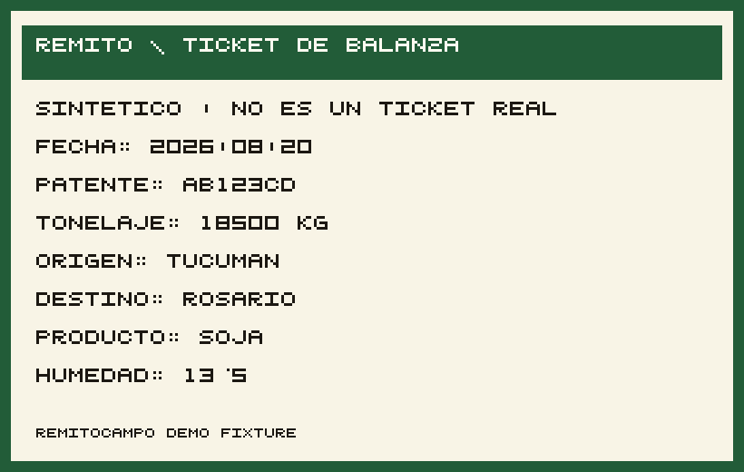

# QCamp

La libreta del productor, en el notebook.

En cosecha el acopio ya digitaliza al pesar. El productor se lleva un **papel**
y no ve esos kilogramos hasta que hay señal. Qcamp corre en el mismo equipo:
sacás una foto del ticket de balanza y quedan fecha, patente y kg en SQLite.
Sin nube. Sin API keys. Los números no salen de la máquina.

<p align="left">
  
</p>

## Qué hace

1. Subís la foto del ticket (o la cargás a mano si no hay modelo).
2. Qcamp lee el papel en el equipo: OCR + un modelo chico (1B) que extrae los campos.
3. Confirmás o editás. Si el modelo inventa toneladas, **no se guarda**.
4. Ves la tabla del día y el total en kilogramos.

Sirve al **productor**, al capataz o al contratista que se queda con la copia
del ticket. No es el software de la balanza ni el del acopio.

Hoy corre en **notebook o PC** (`http://127.0.0.1:8000`). No es una app de celular.

## Cómo funciona

El modelo no “mira” la foto. El OCR pasa el ticket a texto. Un Llama 3.2 1B
(Q4, on-device) arma el remito y solo entonces lo persiste.

```text
foto del ticket
    → OCR (texto)
    → extraer campos (fecha, patente, kg, producto, humedad…)
    → confirmar / editar
    → SQLite local
    → total del día
```

Todo eso queda en el host. Si no hay internet, el flujo sigue: es el modo
de trabajo, no un fallback.

## Correrlo

```bash
git clone git@github.com:Juarex9/QCamp.git
cd QCamp
python3 -m venv .venv
source .venv/bin/activate
pip install -e .
python -m tetherto.qvac_sdk install-worker
REMITO_QVAC=1 make demo
```

Abrí [http://127.0.0.1:8000](http://127.0.0.1:8000) → **Abrir la app**.
Probá con `fixtures/tickets/remito-soja-tucuman.png`. El total del día está en `/resumen`.

La primera vez baja los modelos (OCR + Llama 1B). Después podés cortar la red.
Si el worker no arranca, `REMITO_QVAC=0 make demo` deja el formulario y SQLite
igual. Atajo sin foto: `python scripts/seed_demo.py`.

Python ≥ 3.11. Node ≥ 22.17 solo para el worker QVAC.

## Stack

| Pieza | Qué es |
| --- | --- |
| App | FastAPI + Jinja + HTMX, solo localhost |
| Datos | SQLite (`data/remitos.db`) |
| Inferencia | [QVAC](https://docs.qvac.tether.io/) — `OCR_LATIN` + Llama 3.2 1B Q4 |
| Offline | CSS y UI locales; airplane mode después del setup |

## Más

- [Cómo está hecho](docs/arquitectura.md)
- [Por qué estos modelos](docs/modelos.md)
- [Hackathon / jurado](docs/submit.md)
